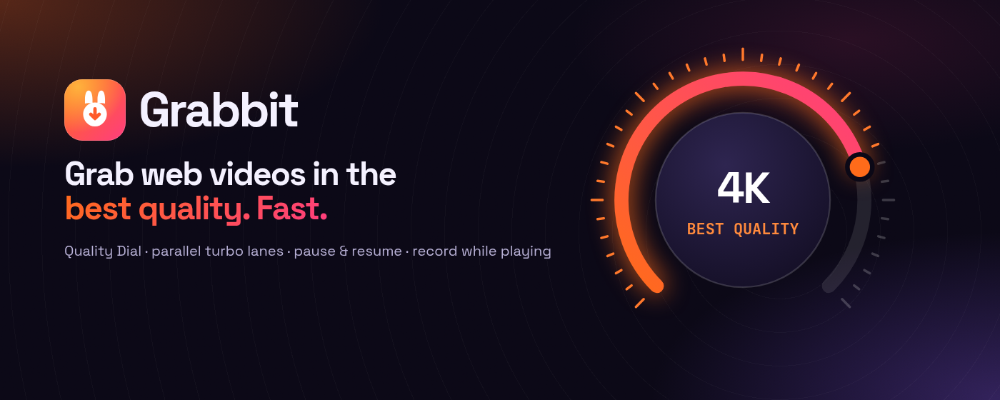
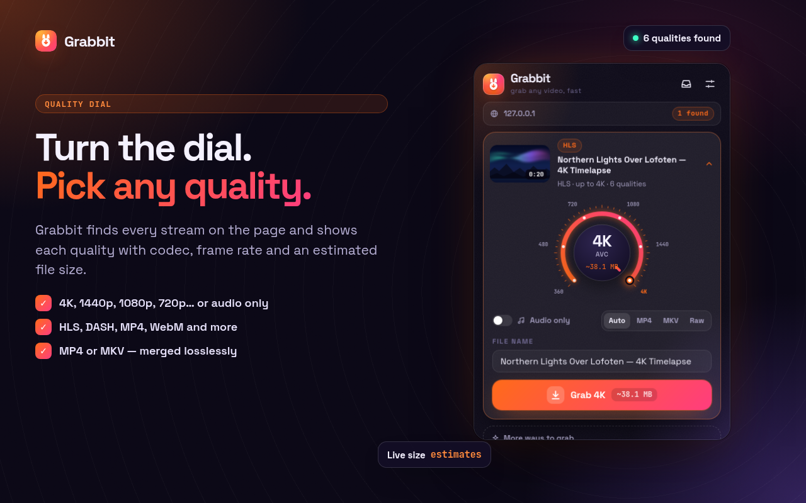
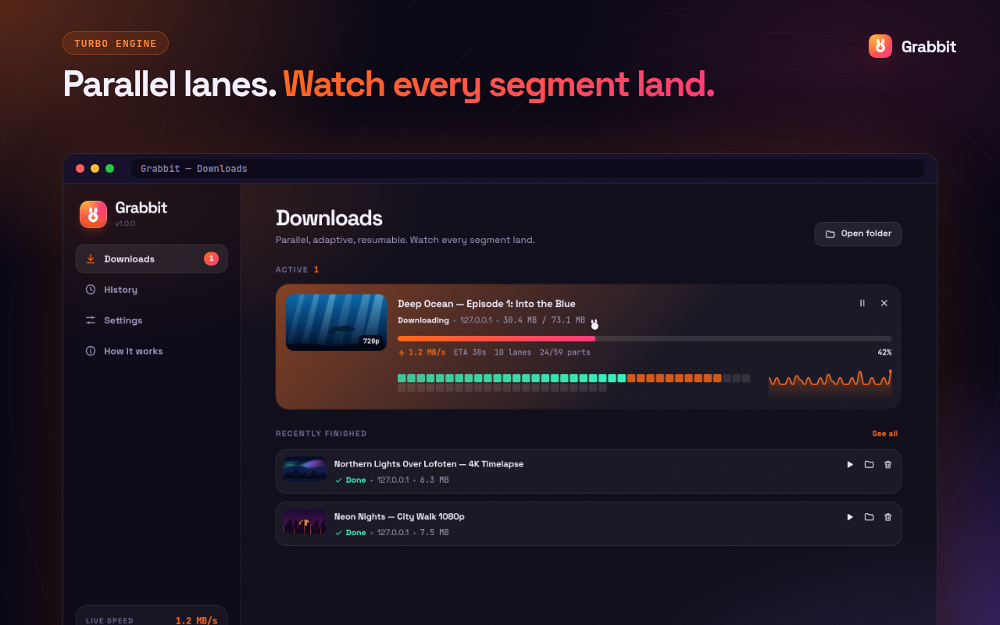
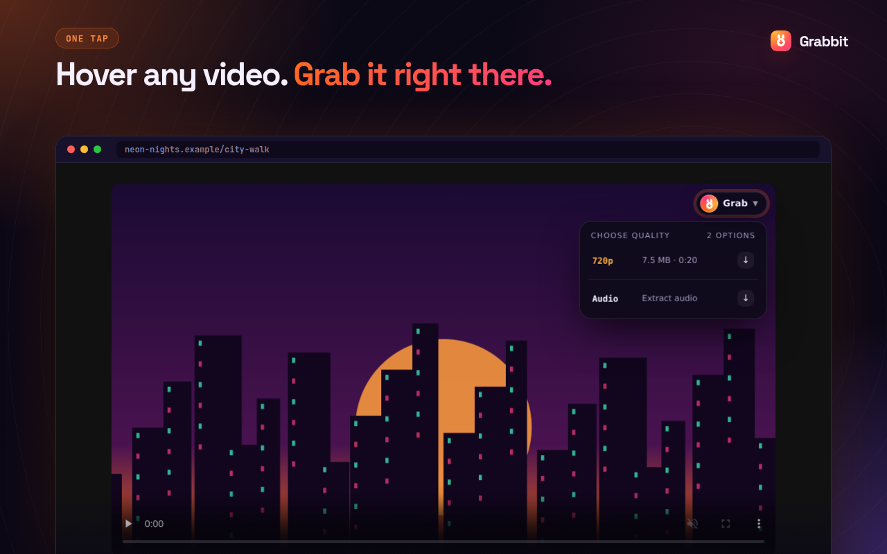
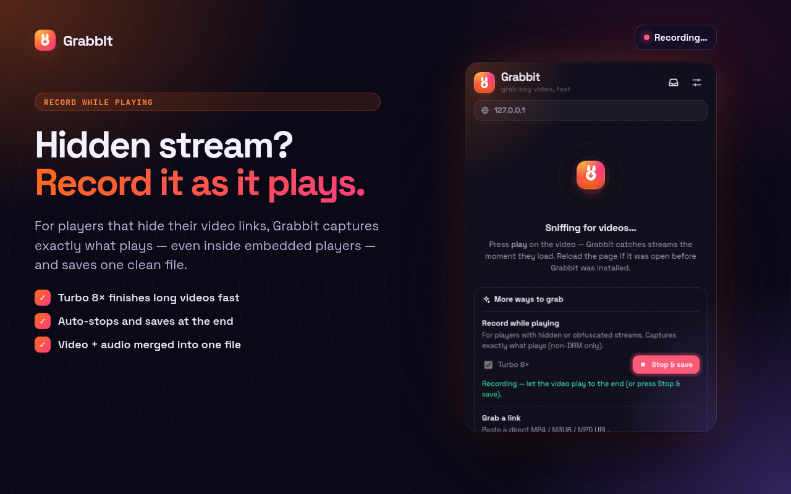
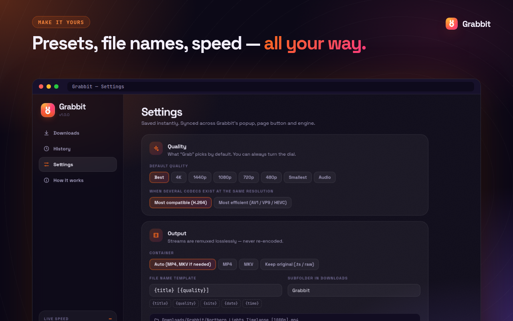

<div align="center">

<a href="https://github.com/mohitbansal25082006/Grabbit">
  
</a>

<h1>
  
  Grabbit
</h1>

<h3>Grab web videos in the best quality. Fast.</h3>

<p>
  <b>Quality Dial</b> · <b>parallel turbo lanes</b> · <b>pause & resume</b> · <b>record while playing</b><br/>
  A Manifest V3 extension for Chrome, Edge, Brave and other Chromium browsers.
</p>

<p>
  <a href="https://github.com/mohitbansal25082006/Grabbit"></a>
  <a href="https://github.com/mohitbansal25082006/Grabbit/stargazers"></a>
</p>

<p>
  
  
  
  
  
  
  
  
</p>

<p>
  <a href="#-features">Features</a> ·
  <a href="#-screenshots">Screenshots</a> ·
  <a href="#-install">Install</a> ·
  <a href="#-how-it-works">How it works</a> ·
  <a href="#-development">Development</a> ·
  <a href="#-publishing">Publishing</a>
</p>

</div>

---

## ✨ Features

<table>
  <tr>
    <td width="50%" valign="top">
      <h3>🎛 Quality Dial</h3>
      Every stream on the page becomes a card. Turn the dial to pick <b>4K, 1440p, 1080p, 720p…</b> or <b>audio only</b>, with codec, frame rate, HDR and a <b>live file-size estimate</b>.<br/><br/>
      Pick the audio track and subtitles (saved as <code>.srt</code>), and save as MP4, MKV or the original format.
    </td>
    <td width="50%" valign="top">
      <h3>⚡ Turbo engine</h3>
      Downloads split into up to <b>32 parallel lanes</b> that adapt to your network in real time, adding lanes while speed improves and backing off when a server throttles.<br/><br/>
      <b>Pause & resume</b> survive browser restarts, and finished chunks are never downloaded twice.
    </td>
  </tr>
  <tr>
    <td width="50%" valign="top">
      <h3>🔎 Finds the streams others miss</h3>
      Detects <b>HLS</b>, <b>DASH</b>, <b>MP4</b>, <b>WebM</b>, <b>MKV</b>, <b>MP3</b>, <b>M4A</b> and more. It catches streams loaded through a site's own player code, links inside the site's data responses, and embedded players inside frames.<br/><br/>
      Ads, previews and stream pieces are filtered out automatically.
    </td>
    <td width="50%" valign="top">
      <h3>🎬 Record while playing</h3>
      For players that hide their links, Grabbit records exactly what plays, even inside embeds, and saves one clean file. Video and audio are merged together.<br/><br/>
      <b>Turbo 8×</b> finishes long videos fast and <b>auto-stops</b> at the end.
    </td>
  </tr>
  <tr>
    <td width="50%" valign="top">
      <h3>🧬 Lossless & large-file safe</h3>
      Separate audio and video are merged <b>without re-encoding</b>. Files are written straight to disk, so multi-GB downloads don't fill your memory.<br/><br/>
      Standard (non-DRM) AES-128 encrypted HLS is decrypted locally, and live HLS can be recorded with Stop & Save.
    </td>
    <td width="50%" valign="top">
      <h3>🐇 A joy to use</h3>
      <b>Hover any video</b> and press <b>Grab</b> right on the page. The Downloads hub shows live speed, active lanes, ETA and a <b>segment map</b> where you watch every piece land.<br/><br/>
      Right-click menu, shortcuts (<kbd>Alt</kbd>+<kbd>Shift</kbd>+<kbd>G</kbd>), and dark & light themes.
    </td>
  </tr>
</table>

> [!NOTE]
> **Respectful by design.** Grabbit does **not** download DRM-protected video and does **not** work on YouTube. Only download content you own or have permission to save.

## 📸 Screenshots

<div align="center">
  
  
  
  
  
</div>

## 🚀 Install

### From source (developer mode)

```bash
git clone https://github.com/mohitbansal25082006/Grabbit.git
cd Grabbit
npm install
npm run build          # → .output/chrome-mv3
```

1. Open `chrome://extensions` (Edge: `edge://extensions`, Brave: `brave://extensions`).
2. Turn on **Developer mode**.
3. Click **Load unpacked** and select `.output/chrome-mv3`.
4. Pin Grabbit from the puzzle-piece menu. 🥕

> [!TIP]
> **Brave users:** if a site's player doesn't load with Shields up, Grabbit can't see the stream either. Lower Shields for that site.

### Using it

| You want to… | Do this |
|---|---|
| Download the video you're watching | Click the Grabbit icon → turn the **Quality Dial** → **Grab** |
| Grab without opening the popup | Hover the video → press the **Grab** pill, or <kbd>Alt</kbd>+<kbd>Shift</kbd>+<kbd>G</kbd> |
| Save only the sound | Toggle **Audio only** (saves `.m4a` / `.mp3` / `.opus`) |
| Download from a player that hides its links | Popup → **More ways to grab** → **Start recording** (optionally **Turbo 8×**) |
| Paste a direct link | Popup → **More ways to grab** → paste an MP4 / M3U8 / MPD URL |
| Watch progress, pause, resume | Open the **Downloads hub** (inbox icon) |

## 🧠 How it works

```
content scripts (every frame)                service worker
├─ hook (page world): fetch/XHR/MSE/EME ─┐   ├─ webRequest sniffer + per-tab registry
├─ DOM + Open Graph/JSON-LD scanner      ├──▶├─ DNR header rules (Referer/Origin replay)
├─ in-page Grab button (Shadow DOM)      │   ├─ menus, shortcuts, notifications, badge
└─ recorder relay → recorder iframe ─────┘   └─ creates the offscreen engine on demand
                                                           │
                         offscreen document ◀──────────────┘
                         ├─ analyzer (HLS/DASH parsers, probing via Mediabunny)
                         ├─ JobManager (queue, IndexedDB persistence, progress broadcast)
                         ├─ JobRunner (adaptive lanes, write window, AES-128, live polling)
                         └─ storage worker (OPFS sync handles + Mediabunny remux)
                                   └─▶ blob URL ─▶ chrome.downloads
```

<details>
<summary><b>Engine details</b></summary>

- **Adaptive lanes:** additive increase, multiplicative decrease (the idea TCP uses). The engine adds connections while throughput improves and backs off on `429`/`503`, stalls or repeated errors.
- **Direct files** are split into byte-range chunks and written in place on disk. **Stream segments** go through an in-order write window, so memory stays bounded.
- **Retries** use jittered exponential backoff, honor `Retry-After`, and refresh expired HLS segment tokens by re-fetching the playlist.
- **Headers:** the page's `Referer`, `Origin` and auth headers are replayed only for that download's hosts, using temporary `declarativeNetRequest` session rules.
- **Remux:** [Mediabunny](https://github.com/Vanilagy/mediabunny) copies packets (TS→MP4, audio+video→MP4/MKV) and never re-encodes.

</details>

<details>
<summary><b>Project layout</b></summary>

| Path | What's inside |
|---|---|
| `src/entrypoints/` | Background worker, content scripts, popup, Downloads hub, offscreen engine, recorder |
| `src/lib/parsers/` | Dependency-free HLS, DASH and XML parsers |
| `src/lib/engine/` | Planner, adaptive scheduler, network layer, job runner, storage worker |
| `src/components/` | Svelte 5 UI: Quality Dial, Segment Mosaic, Hopper progress bar, Sparkline… |
| `tests/` | Unit, end-to-end and UI click tests, plus the fixture generator and test server |
| `store/` | Chrome Web Store package, images and listing text |

</details>

### Built with

<p>
  
  
  
  
  
  
</p>

## 🛠 Development

| Command | What it does |
|---|---|
| `npm run dev` | Development build with hot reload |
| `npm run build` | Production build → `.output/chrome-mv3` |
| `npm run zip` | Store-ready ZIP → `.output/grabbit-<version>-chrome.zip` |
| `npm run check` | Type-check TypeScript and Svelte |
| `npm test` | Unit tests: parsers, quality picker, scheduler, subtitles, utilities |
| `npm run fixtures` | Generate real HLS/DASH/MP4/WebM test media (needs `ffmpeg`, or set `$FFMPEG`) |
| `npm run test:e2e` | End-to-end: loads the extension in Chromium and downloads real streams |
| `npm run test:ui` | UI tests: clicks through the popup, the hub and every setting |
| `npm run store` | Regenerate all Chrome Web Store images from the real UI |
| `npm run icons` | Re-render the PNG icons from the SVG logo |

**Test coverage** includes:
- byte-exact ranged downloads and pause/resume
- HLS (TS) behind a Referer check, AES-128 decryption, and fMP4 with a separate audio track
- DASH audio+video merge, audio-only output and WebM
- record-while-playing inside an iframe (manual stop and Turbo auto-stop)
- the YouTube exclusion
- every popup, hub and settings control

## 📦 Publishing

Everything for the Chrome Web Store lives in [`store/`](store/):

- `grabbit-1.0.0-chrome.zip`: the package to upload
- `icon-128.png`, five 1280×800 screenshots, and the 440×280 and 1400×560 promo tiles
- [`LISTING.md`](store/LISTING.md): every dashboard field, ready to paste (description, permission justifications, privacy answers, reviewer test instructions)

The privacy policy is [`PRIVACY.md`](PRIVACY.md).

## 🔒 Privacy

Grabbit has no accounts, no analytics, no ads and no remote code. Everything runs locally in your browser, and it only talks to the servers that host the video you choose. Read the full [privacy policy](PRIVACY.md).

## 🤝 Contributing & support

Found a site where Grabbit misses a video, or have an idea? [Open an issue](https://github.com/mohitbansal25082006/Grabbit/issues). Pull requests are welcome, too.

---

<div align="center">
  <br/>
  <b>Made with 🥕 by <a href="https://github.com/mohitbansal25082006">Mohit Bansal</a></b><br/>
  <a href="https://github.com/mohitbansal25082006/Grabbit">github.com/mohitbansal25082006/Grabbit</a><br/><br/>
  If Grabbit saves you time, give it a ⭐ on GitHub!
</div>
