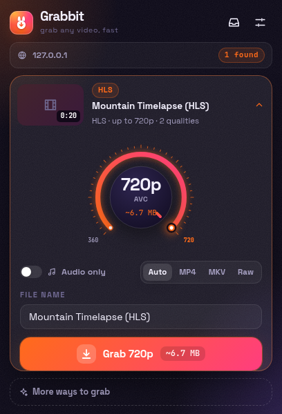
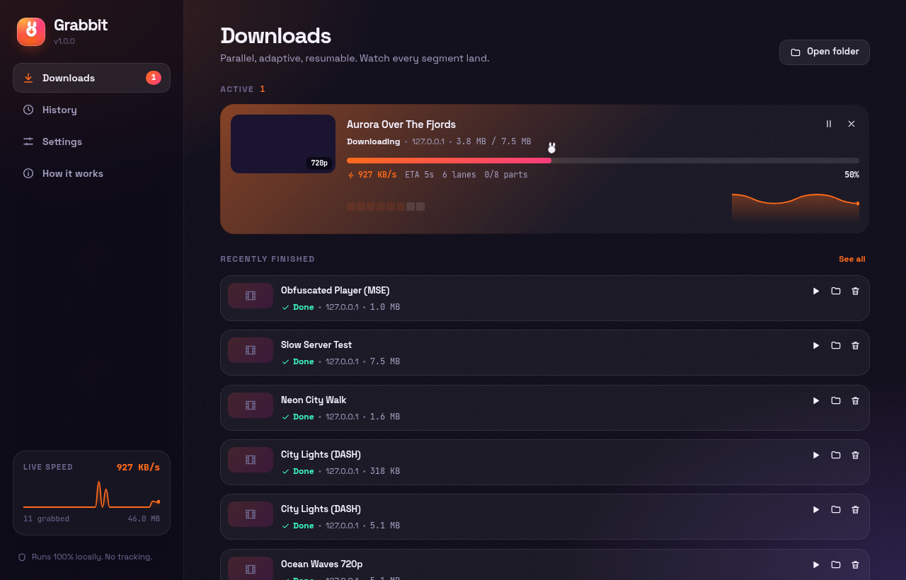

<p align="center">
  
</p>

<h1 align="center">Grabbit</h1>
<p align="center"><b>Grab web videos in the best available quality, fast.</b><br/>
A Manifest V3 extension for <b>Chrome, Edge and Brave</b> (and other Chromium browsers).</p>

<p align="center">
  
  &nbsp;
  
</p>

---

## Features

**Detection**
- Watches the browser's network traffic for **HLS (`.m3u8`)**, **DASH (`.mpd`)** and direct **MP4 / WebM / MKV / MOV / MP3 / M4A** files. It filters out segments, ads and tiny files.
- A page hook inspects `fetch`/XHR responses. It catches manifests served from API URLs and media links inside **JSON API responses**.
- Scans the page itself: `<video>`/`<audio>` elements (including inside shadow DOM), Open Graph and JSON-LD `VideoObject` tags.
- Groups quality variants of the same file (e.g. `…/1280x720/…` and `…/640x360/…`) into one card.
- **Record while playing**: a fallback for players that hide their streams. It captures the MediaSource data as it plays, and **Turbo 8×** plays the video faster to finish sooner. Works on non-DRM video only.

**Quality control**
- The **Quality Dial**: a rotary control that snaps to every available quality. It shows codec, frame rate, HDR and an **estimated file size**.
- Presets (Best, 4K, 1440p, 1080p, 720p, 480p, Smallest, Audio), a codec preference (most compatible H.264, or most efficient AV1/VP9/HEVC), and per-site quality rules.
- Choice of audio track, subtitles (saved as `.srt`), audio-only (`.m4a`, `.mp3`, `.opus`), and output format (Auto, MP4, MKV or the raw stream).

**Speed engine**
- **Adaptive parallel lanes**: up to 32 connections per download. The engine adds lanes while throughput improves and backs off when a server throttles (AIMD, the same idea TCP uses).
- Direct files are split into byte-range chunks and written in place. Stream segments go through an in-order write window.
- **Lossless remuxing** with [Mediabunny](https://github.com/Vanilagy/mediabunny): TS→MP4 and separate audio+video merged into one file, never re-encoded.
- Downloads are written to disk through **OPFS**, so multi-GB files don't need to fit in memory.
- **Pause and resume**, including after a browser restart. Finished chunks are never downloaded again.
- Retries with jittered exponential backoff and `Retry-After` support. Stalled connections are detected. For HLS, expired segment tokens are refreshed automatically.
- **AES-128 HLS** decryption (the standard, non-DRM encryption), done in the browser with WebCrypto.
- Replays the page's `Referer`, `Origin` and authorization headers for each download's hosts, using `declarativeNetRequest` session rules.
- **Live HLS recording** with Stop & Save.

**Interface**
- **Burrow Neon** design: deep violet background with a carrot accent, grain texture and ambient glows, plus a daylight theme.
- In-page **Grab** button on videos. It lives in a closed Shadow DOM so site CSS can't break it.
- **Downloads hub** with a live **segment mosaic**, a speed sparkline, lane count, ETA and history.
- Right-click menu: *Grab this video*, *Grab audio only* and *Grab linked media*.
- Shortcuts: <kbd>Alt</kbd>+<kbd>Shift</kbd>+<kbd>G</kbd> grabs the best video on the page, and <kbd>Alt</kbd>+<kbd>Shift</kbd>+<kbd>V</kbd> opens Grabbit.

**By design, Grabbit does not:**
- download **DRM-protected** video (Widevine, PlayReady or FairPlay). It detects such video and labels it 🔒.
- work on **YouTube**. YouTube is excluded to respect its Terms of Service and the browser stores' policies.

Grabbit sends no telemetry, loads no remote code, and everything runs on your machine.

## Install

```bash
npm install
npm run build          # → .output/chrome-mv3
```

1. Open `chrome://extensions` (Edge: `edge://extensions`, Brave: `brave://extensions`).
2. Turn on **Developer mode**.
3. Click **Load unpacked** and select `.output/chrome-mv3`.
4. Pin Grabbit from the puzzle-piece menu.

`npm run zip` produces store-ready zip files for Chrome and Edge.

> **Brave:** if a site's player doesn't load with Shields up, Grabbit can't see the stream either. Lower Shields for that site.

## Publishing

Everything for the Chrome Web Store is in [`store/`](store/): the ready-to-upload package, the store icon, five 1280×800 screenshots, promo tiles, and [`store/LISTING.md`](store/LISTING.md) with every dashboard field filled in (description, permission justifications, privacy answers, reviewer test instructions). The privacy policy is in [`PRIVACY.md`](PRIVACY.md). `npm run store` regenerates the images.

## Development

| Command | What it does |
|---|---|
| `npm run dev` | Development build with hot reload (opens a browser with the extension loaded) |
| `npm run build` | Production build |
| `npm run check` | Type-check TypeScript and Svelte |
| `npm test` | Unit tests (parsers, quality picker, scheduler, subtitles, utilities) |
| `npm run fixtures` | Generate real HLS/DASH/MP4/WebM test media (needs `ffmpeg`, or set `$FFMPEG`) |
| `npm run test:e2e` | End-to-end tests: loads the built extension in Chromium and downloads real streams |
| `npm run test:ui` | UI tests: clicks through the popup, the Downloads hub and every setting |
| `npm run icons` | Re-render the PNG icons from the SVG logo |

The E2E suite covers byte-exact ranged downloads, HLS (TS) behind a Referer check, choosing a variant, AES-128 decryption, fMP4 with a separate audio track found through a JSON API, merging DASH audio and video, audio-only output, WebM, pause and resume, record-while-playing, and the YouTube exclusion.

## Architecture

```
content scripts (every frame)                service worker
├─ hook (page world): fetch/XHR/MSE/EME ─┐   ├─ webRequest sniffer + per-tab registry
├─ DOM + Open Graph/JSON-LD scanner      ├──▶├─ DNR header rules (Referer/Origin replay)
├─ in-page Grab button (Shadow DOM)      │   ├─ menus, shortcuts, notifications, badge
└─ recorder relay → recorder iframe ─────┘   └─ creates the offscreen engine on demand
                                                           │
                         offscreen document ◀──────────────┘
                         ├─ analyzer (HLS/DASH parsers, probing via Mediabunny)
                         ├─ JobManager (queue, IndexedDB persistence, progress broadcast)
                         ├─ JobRunner (adaptive lanes, write window, AES-128, live polling)
                         └─ storage worker (OPFS sync handles + Mediabunny remux)
                                   └─▶ blob URL ─▶ chrome.downloads
```

Source layout:
- `src/entrypoints/`: background, content scripts, popup, hub, offscreen engine, recorder
- `src/lib/parsers/`: dependency-free HLS, DASH and XML parsers
- `src/lib/engine/`: planner, scheduler, network layer, job runner, storage worker
- `src/components/`: Svelte 5 UI (Quality Dial, Segment Mosaic, Hopper progress bar, Sparkline and more)

## Responsible use

Only download content you own or have permission to save. Respect creators' rights and each site's terms of service.
